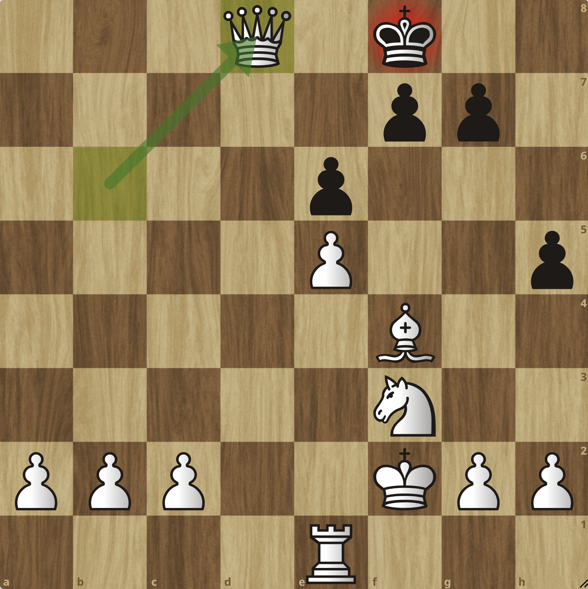
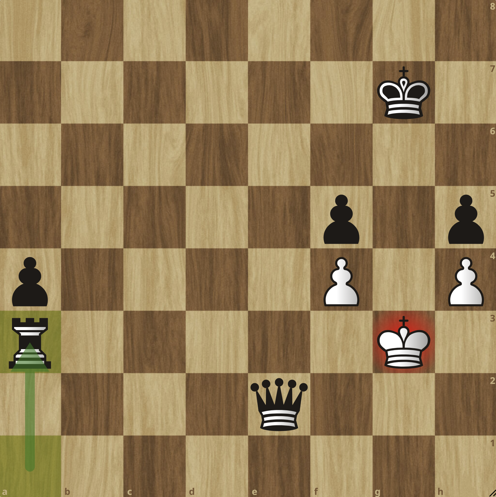

# Chess Engine

A classical chess engine written in Python, built around a search-and-evaluation framework using `python-chess`.

The project focuses on implementing and analyzing the core components of a traditional chess engine: static position evaluation, alpha-beta algorithmic search, quiescence search, transposition tables, iterative deepening, and practical time management.


## Features

The engine currently includes:

- **Static evaluation** based on material balance, phase-dependent
  piece-square tables, and positional heuristics
- **Alpha-beta search** using a minimax algorithm
- **Quiescence search** for tactical stabilization beyond regular leaf nodes
- **Move ordering** for captures, promotions, checks, and transposition-table moves
- **Memory caching** with a transposition table and Zobrist hashing
- **Iterative deepening** with time-controlled search and a time-management system
- **Search instrumentation** recording nodes, depth, pruning activity,
  transposition-table usage, NPS, and timing
- **Command-line play**
- **UCI support** for chess GUIs and engine-to-engine communication

For a detailed explanation of the implementation and design choices, see the
[technical report](technical_report.pdf).


## Testing

Version 1.1 was benchmarked against **Stockfish** under a controlled engine-to-engine setup in which both engines received 2.0 seconds per move. The benchmark recorded the W-D-L records and move-level diagnostics such as search depth, node counts, pruning activity, transposition-table usage, and time management.

See the [testing report](testing_report.pdf) for detailed methodology, metrics, and results.

<p  align="center">


</p>


## Usage

#### CLI mode

Play interactively against the engine in the terminal by entering moves in standard algebraic notation (SAN):

```bash
python chess_engine.py cli
```

#### UCI mode

Run the engine as a UCI-compatible process:

```bash
python chess_engine.py uci
```


## Changelog

- **v1.0**
  - Static board evaluation (material balance + positional advantage)
  - Minimax search algorithm with alpha-beta pruning
  - Search optimization features (move-ordering heuristics)
  - Memory caching and probing through transposition table and Zobrist hashing
  - Command-line play mode
  - UCI support

- **v1.1 - Current public release**
  - Iterative deepening and time management
  - Phase-dependent PSTs
  - Search instrumentation

- **v1.2 (Planned)**
  - More advanced move-ordering heuristics (killer-move & history heuristics)
  - Selective-search techniques (e.g. null-move pruning)
  - Data structure overhaul (lower-level optimization of computational speed)
  - Opening book and endgame tablebases
